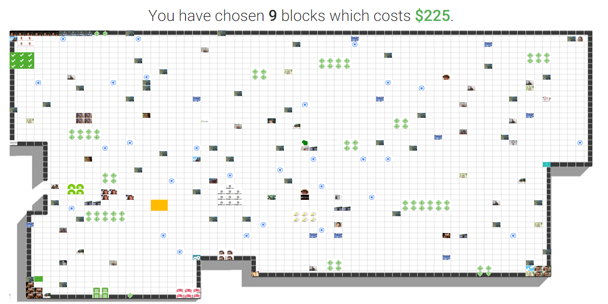
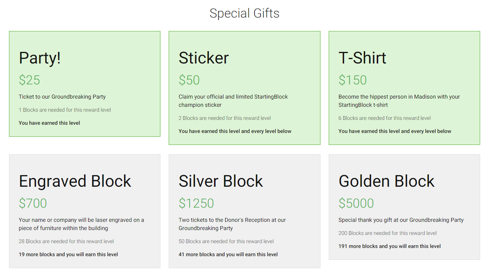
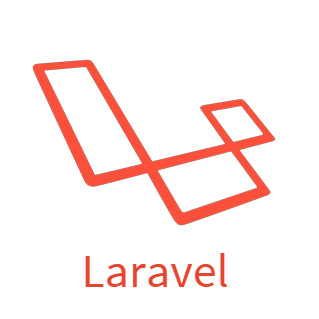

## Donate Mosaic

The Donate Mosaic is an application that allows for 2-dimensional fundraising. Donors can buy themselves a piece of project — virtually, at least.

### Reward Levels

### Built on

### Card

Utilizes Card

### License

The Donate Mosaic is open-sourced software licensed under the [MIT license](http://opensource.org/licenses/MIT)
